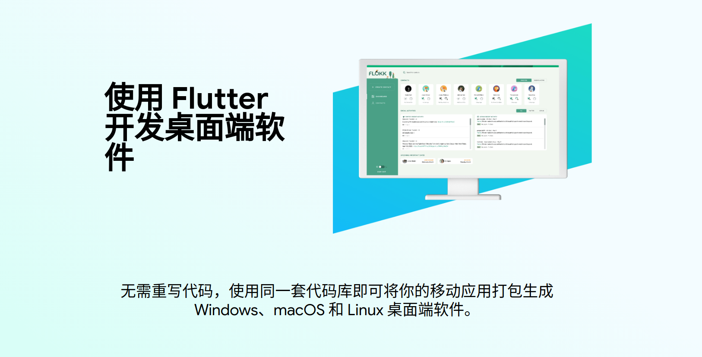
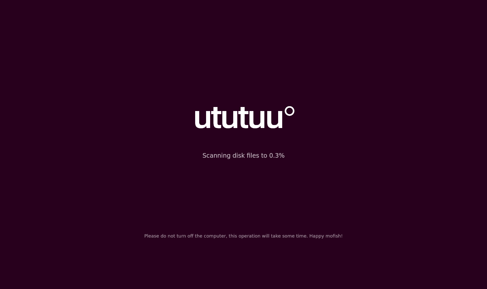

# mofish

Flutter Linux desktop版本App初探。

## 背景

Google已经重磅发布了专为 Web、移动和桌面而构建的 Flutter 2.0！将 Flutter 从移动开发框架扩展成可移植框架，使用 Flutter 开发桌面端软件，无需重写代码，使用同一套代码库即可将你的移动应用打包生成 Windows、macOS 和 Linux 桌面端软件。Flutter似有大一统之势。




由于我司程序员使用ubuntu系统，而我也早已习惯了使用Linux开发。因此Flutter支持开发桌面端软件成功引起了我的注意。正赶上看到网上有很多关于《摸鱼》app的介绍，这也给了我灵感，可以实现一个类似Linux桌面版本app，来看一下效果。


## Getting Started

### 安装flutter

这一部分flutter官网已经讲述的很清楚了，大家照做就行：
https://flutter.cn/docs/get-started/install/linux


### 配置

这里需要说明一下的是：使用flutter开发linux desktop app需要安装依赖项：

```
sudo apt-get install clang cmake ninja-build pkg-config libgtk-3-dev
sudo apt install liblzma-dev
```

Flutter默认是关闭桌面应用的，我们可以使用下面的命令开启：

```
flutter config --enable-linux-desktop
```


### 创建项目

开发Linux app和开发flutter移动端app在创建项目并无区别。

**创建项目**

```
flutter create mofish
```

**运行项目**

```
cd mofish/
flutter run -d linux
```

需要注意点是：在编译运行的时候需要使用`-d`属性来指定运行目标


### 开始编码

我们来首先看一下要实现的效果：



这里为了防止出现授权的问题，我自己画了一个logo，把这个logo放到images文件夹下，并且修改pubspec.yaml加上资源引用：

```
  assets:
    - images/ututuu1.png
```

然后实现这个布局：
```dart
@override
  Widget build(BuildContext context) {
    return Scaffold(
        // 背景色
        backgroundColor: const Color.fromARGB(255, 40, 0, 29),
        appBar: null,
        // 主体布局采用一个层叠布局，水平居中
        body: Stack(
          alignment: Alignment.center,
          children: [
            Center(
              // logo的部分在全局居中
              child: Column(
                mainAxisAlignment: MainAxisAlignment.center,
                children: <Widget>[
                  Center(
                    child: Image.asset(
                      'images/ututuu1.png',
                      width: 400,
                    ),
                  ),
                  Text(
                    'Scanning disk files to 30%',
                    style: const TextStyle(color: Colors.white70, fontSize: 24),
                  ),
                  Container(
                    height: 50,
                  )
                ],
              ),
            ),
            // 提示语布局在底部居中的位置
            const Positioned(
              bottom: 200,
              child: Text(
                'Please do not turn off the computer, this operation will take some time. Happy mofish!',
                style: TextStyle(color: Colors.white54, fontSize: 18),
              ),
            ),
          ],
        ));
  }
```


**loading动画**

loading动画这里使用他人造好的轮子：[loading_animation_widget](https://pub.flutter-io.cn/packages/loading_animation_widget)

```
dependencies:
  loading_animation_widget: ^1.1.0+1
```


**使用hexagonDots控件来实现loading效果**


```dart
// loading动画
                  Container(
                    padding: const EdgeInsets.only(top: 40, bottom: 10),
                    child: LoadingAnimationWidget.hexagonDots(
                      color: Colors.white,
                      size: 40,
                    ),
                  ),
```


**加载进度更新**

使用Timer.periodic函数来实现倒计时，并且计算进度值

```dart
class _MyHomePageState extends State<MyHomePage> {
  late Timer _timer;
  int _countdownTime = 0;
  double _currentProcess = 0;

  void _onExitApp() {
    exit(0);
  }

  @override
  void initState() {
    super.initState();
    startCountdownTimer();
  }

  /*
   * 实现倒计时
   */
  void startCountdownTimer() {
    const oneSec = Duration(seconds: 1);

    var callback = (timer) => {
          setState(() {
            if (_countdownTime > 999) {
              _currentProcess = 99;
              _timer.cancel();
            } else {
              _countdownTime += 1;
              _currentProcess = _countdownTime / 10;
            }
          })
        };

    _timer = Timer.periodic(oneSec, callback);
  }

  @override
  void dispose() {
    super.dispose();
    if (_timer != null) {
      _timer.cancel();
    }
  }
}
```

在布局中展示_currentProcess的值：

```dart
Text(
                    'Scanning disk files to ${_currentProcess.toString()}%',
                    style: const TextStyle(color: Colors.white70, fontSize: 24),
                  ),
```


**应用全屏显示**

摸鱼这类app的效果应该全屏展示才会逼真，linux实现全屏效果只需要"linux/my_application.cc"中加入一行代码即可：

```
  gtk_window_fullscreen (GTK_WINDOW(window));
```

应用退出

上面我们把app设置了全屏展示，就没有了关闭应用的按钮。为了隐蔽，我们可以设置一个退出应用的触发开关。这里给logo设置一个双击事件，在双击logo的时候执行退出app。

```dart
                  // 给logo加入点击事件，双击可以退出app
                  GestureDetector(
                    onDoubleTap: () => _onExitApp(),
                    child: Center(
                      child: Image.asset(
                        'images/ututuu1.png',
                        width: 400,
                      ),
                    ),
                  ),
```


以上，所有coding完毕，完整的代码可以在Github中查看。https://github.com/shijiacheng/mofish


### 创建 release 版本的应用

可以通过下面命令来编译release版本的app：

```
flutter build linux --release
```
编译的产物会存放在：
项目下的 build/linux/x64/release/bundle/ 路径下找到可执行文件。同时在 bundle 目录下还有两个文件夹：

- lib 包含必需的 .so 库文件
- data 包含应用的资源，例如字体和图片

可以双击直接运行mofish。

至此，一个flutter linux desktop app已经开发完毕。


## 感谢

- 感谢[《10分钟用Flutter写出摸鱼桌面版App》](https://juejin.cn/post/7042349287560183816)的作者，此文开发了一个macos版本的app，我的想法来源于此。


- 感谢开源库[loading_animation_widget](https://pub.flutter-io.cn/packages/loading_animation_widget)的作者。


## 最后说一句

工作要劳逸结合，但摸鱼之举不可取，幸福都是奋斗出来的！